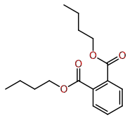

## 01_simple

| Exercise | Correction |
|----------|------------|
| 01 |  |
| 02 |  |
| 03 |  |
| 04 |  |
| 05 |  |
| 06 |  |
| 07 |  |
| 08 |  |
| 09 |  |
| 10 |  |

## 02_medium

| Exercise | Correction |
|----------|------------|
| 11 |  |
| 12 |  |
| 13 |  |
| 14 |  |
| 15 |  |
| 16 |  |
| 17 |  |
| 18 |  |
| 19 |  |

## 03_advanced

| Exercise | Correction |
|----------|------------|
| 20 |  |
| 21 |  |
| 22 |  |
| 23 |  |